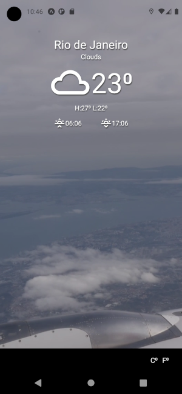
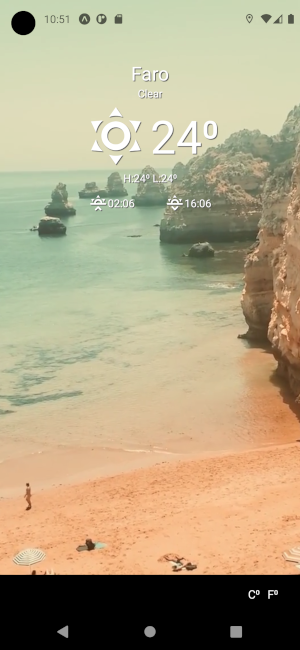

weather-app
===========

A simple weather app for demonstrating react-native skills.

Application screenshots
-----------------------




How to run
----------

### System requirements

- [Node.js](https://nodejs.org/en/) 11 or above
- [Expo CLI](https://docs.expo.io/) 4.5 or above
- [Yarn](https://yarnpkg.com/getting-started/install) (is optional, but recommended)

### Step 1 - Change .env file

This application uses OpenWeather API to get weather data. You need to register yourself in [OpenWeather](https://openweathermap.org/) and put your access token on the enviroment variable `WEATHER_API_KEY` in the `.env` file.

**Warning:** If you do not have an account in OpenWeather and need to register a new account, your access token may have a delay to be accessible.

### Step 2 - Starting Metro Server (used by Expo)

Metro Server is the resource responsibly to starts your application on your phone or on a Android/iOS simulator. You can start this server using the command below.

```
$ yarn start
```

### Step 3.1 - Starting the application on your phone

You can start this application on your phone using the Expo application. Search on your Play Store(Android) or App Store(iOS) and install Expo.

After installing Expo, open your Camera app or a QR code reader on your phone. Read the QR code shown on your PC.

### Step 3.2 - Starting the application on an mobile simulator

Firstly, you need to open your Android/iOS simulator. After your Android/iOS simulator is started, you need to start this application interacting with the Expo terminal or Expo Developer Tools on your browser.

#### **Expo terminal interaction example**

1. Start Metro Server
```
$ yarn start

yarn run v1.22.10
Starting project at /home/rmello/Works/weather-app
Developer tools running on http://localhost:19002
Opening developer tools in the browser...
Starting Metro Bundler

 › Waiting on exp://192.168.0.11:19000
 › Scan the QR code above with Expo Go (Android) or the Camera app (iOS)

 › Press a │ open Android
 › Press w │ open web

 › Press r │ reload app
 › Press m │ toggle menu
 › Press d │ show developer tools
 › shift+d │ toggle auto opening developer tools on startup (enabled)

 › Press ? │ show all commands

Logs for your project will appear below. Press Ctrl+C to exit.

```

2. Press `a` to open this application on your Android emulator.

#### **Expo Developer Tools interaction example**

1. Start Metro Server

```
$ yarn start
```

2. Press `Run on Android device / emulator` or `Run on iOS simulator` button to open this application on your Android/iOS simulator.


Used technologies
-----------------

- React
- React-native
- Expo
- Styled Components

Applied concepts
----------------

- Multiple pages (although this application has only one page)
- Locate watcher
- i18n localization
- Single responsibility file structure
- Componentes by reusability

Future changes suggestions
--------------------------

- Show on the screen another weather data(like humidity, pressure, feels like, wind speed, etc..);
- Be able to show weather for specific regions and not only for current position;
- Local weather data persist using AsyncStorage and mobx-persist to show the last weather if the device does not have internet access;
